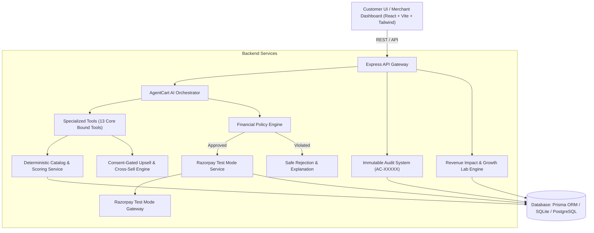

# AgentCart — AI Growth & Agentic Commerce Platform

**Razorpay AI Buildathon 2026 Submission** • **Track: AI Growth & Agentic Commerce**

[]()
[]()
[]()
[]()

> **AgentCart** is an AI-native commerce platform where an intelligent sales agent understands customer intent, discovers the right catalog products, recommends high-margin upsells with explicit consent, and completes secure Razorpay Test Mode transactions under strict policy controls.

---

## 1. Problem Statement

Traditional e-commerce shopping suffers from three critical bottlenecks:
1. **Search Disconnect**: Keyword search fails to map complex customer requirements (e.g. *"laptop for AI development under ₹80k with dedicated GPU"*).
2. **Passive Catalogs**: Chatbots stop at giving text recommendations and cannot complete transactions.
3. **Missed Revenue**: Merchants fail to pitch relevant warranties or accessories at the moment of peak purchase intent, or use intrusive auto-add dark patterns.

---

## 2. The Solution: AgentCart

AgentCart introduces **Bounded Agentic Commerce**:
* **Natural Intent Extraction**: Converts unstructured requirements into structured constraints.
* **Deterministic Catalog Scoring**: Multi-factor ranking (Match + Price Fit + Rating + Stock + Priority).
* **Consent-Gated Upselling**: AI identifies high-margin add-ons but **never** auto-adds them without explicit customer approval.
* **Financial Policy Engine**: Guards all money movements against transaction caps and discount thresholds.
* **Razorpay Test Mode Pipeline**: End-to-end checkout with server-side HMAC-SHA256 signature verification.
* **Immutable Audit Trail (`AC-XXXXX`)**: Every action is cryptographically indexed and inspectable.

---

## 3. System Architecture



---

## 4. AI Agent Workflow

$$\text{OBSERVE} \rightarrow \text{UNDERSTAND} \rightarrow \text{SEARCH} \rightarrow \text{RANK} \rightarrow \text{RECOMMEND} \rightarrow \text{IDENTIFY REVENUE OPPORTUNITY} \rightarrow \text{ASK USER APPROVAL} \rightarrow \text{VALIDATE POLICY} \rightarrow \text{EXECUTE ACTION} \rightarrow \text{VERIFY RESULT} \rightarrow \text{LOG ACTION}$$

---

## 5. Technology Stack

* **Frontend**: React 18, TypeScript, Vite, Tailwind CSS, Lucide Icons, Recharts, Canvas Confetti.
* **Backend**: Node.js, Express, TypeScript (Strict mode).
* **Database & ORM**: Prisma ORM with SQLite (instant zero-dependency local setup) and PostgreSQL compatibility.
* **Payments**: Razorpay Test Mode API + Server-side HMAC-SHA256 signature verification.
* **AI Orchestration**: Structured Tool/Function Calling + Deterministic multi-factor scoring fallback.
* **Testing**: Vitest test suites for pricing, policy, payment signatures, and agent tools.

---

## 6. Financial Policy Engine Rules

* `MAX_TRANSACTION_AMOUNT`: Capped at **₹1,00,000 INR** per order.
* `MAX_DISCOUNT_PERCENT`: Hard-capped at **15%** to protect merchant margins.
* `UPSELL_REQUIRES_CUSTOMER_APPROVAL`: Mandatory customer affirmative click.
* `PAYMENT_REQUIRES_CUSTOMER_CONFIRMATION`: Verified payment consent before launching Razorpay.

---

## 7. Quickstart & Local Setup

### Prerequisites
* Node.js v18+ (tested on Node v22 and v25)
* npm v9+

### 1. Install All Dependencies
```bash
npm install
npm --prefix server install
npm --prefix client install
```

### 2. Configure Environment Variables
Copy `.env.example` to `server/.env`:
```bash
cp .env.example server/.env
```

### 3. Initialize Database & Seed Catalog (140+ Products)
```bash
npm --prefix server run prisma:generate
npm --prefix server run prisma:push
npm --prefix server run seed
```

### 4. Run Development Servers
```bash
npm run dev
```
* **Frontend**: http://localhost:5173
* **Backend**: http://localhost:5000

---

## 8. Running Automated Tests

Run the test suite covering pricing, policy validation, payment signatures, and agent tools:

```bash
npm test
```

---

## 9. 5-Minute Judge Demo Flow

1. Open **AgentCart** at `http://localhost:5173`.
2. Click **"Load Demo Prompt (₹80k AI Laptop)"** in the top floating **DemoBar**.
3. Observe AI structured intent extraction and top 3 ranked recommendations.
4. Click **"Compare"** to view the side-by-side specification matrix.
5. Click **"Select Product"** on the **ASUS TUF A15 AI Edition** (₹74,999).
6. Observe the consent-gated upsell prompt for the 2-year protection plan (₹2,499).
7. Click **"Accept & Add for ₹2,499"**.
8. Click **"Confirm Purchase & Launch Razorpay Checkout"**.
9. Complete the payment in the **Razorpay Test Mode Modal**.
10. View the confirmed order screen with celebratory confetti and audit code (`AC-XXXXX`).
11. Navigate to **Merchant Dashboard** to observe real-time revenue uplift and AOV expansion.
12. Navigate to **Audit Trail** to inspect the immutable event log.

---

## 10. Documentation Index for Judges

* [Architecture Overview](file:///c:/Razorpay%20Buildathon/docs/architecture.md)
* [AI Agent & Tool Orchestration](file:///c:/Razorpay%20Buildathon/docs/ai-agent.md)
* [Razorpay Test Mode Payment Pipeline](file:///c:/Razorpay%20Buildathon/docs/payment-flow.md)
* [Financial Policy Engine](file:///c:/Razorpay%20Buildathon/docs/policy-engine.md)
* [Immutable Audit System](file:///c:/Razorpay%20Buildathon/docs/audit-system.md)
* [Graceful Failure Handling & Simulations](file:///c:/Razorpay%20Buildathon/docs/failure-handling.md)
* [A/B Revenue Experiment Evaluation](file:///c:/Razorpay%20Buildathon/docs/evaluation.md)
* [Full 5-Minute Demo Script](file:///c:/Razorpay%20Buildathon/docs/demo-script.md)

---

## 11. Buildathon Submission Declaration

This project was built for the **Razorpay AI Buildathon 2026**. It uses Razorpay Test Mode APIs for demonstrating end-to-end payment processing in an agentic commerce environment.
