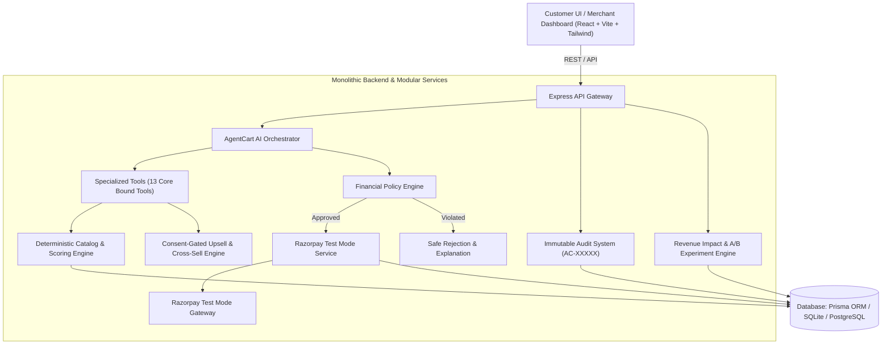

# AgentCart System Architecture

## 1. Overview & Core Philosophy

**AgentCart** is an AI-native commerce and growth platform engineered for the **Razorpay AI Buildathon 2026 (AI Growth & Agentic Commerce track)**.

The core differentiator is: **AI does not stop at product recommendation.** It assists throughout the commerce lifecycle—discovering catalog products, proposing high-margin complementary items with explicit consent, checking financial policies, initializing Razorpay Test Mode checkout, and cryptographically verifying payment signatures before order fulfillment.

---

## 2. Technology Stack

* **Frontend**: React 18 + TypeScript + Vite + Tailwind CSS + Lucide Icons + Recharts + Canvas Confetti.
* **Backend**: Node.js + Express + TypeScript in strict mode.
* **Database & ORM**: Prisma ORM with SQLite (for zero-dependency local execution) and PostgreSQL compatibility (Neon/Supabase ready).
* **Payment Processing**: Razorpay Test Mode API + Server-side HMAC-SHA256 signature verification.
* **AI Orchestration**: Structured Tool/Function Calling with deterministic fallback engine and multi-factor catalog scoring.

---

## 3. Data Flow & Security Boundaries

1. **No Raw LLM Access to Secrets**: The LLM engine never possesses direct access to Razorpay API secret keys or raw database credentials.
2. **Server-Side Price Calculation**: Prices, discounts, and order subtotals are always computed and verified server-side.
3. **Bounded Autonomy**: All financially meaningful actions must be validated by the **Financial Policy Engine** before execution.
4. **Immutable Audit Trail**: Every AI decision, customer approval, policy check, and payment transition produces an immutable audit record tagged with an `AC-XXXXX` identifier.
