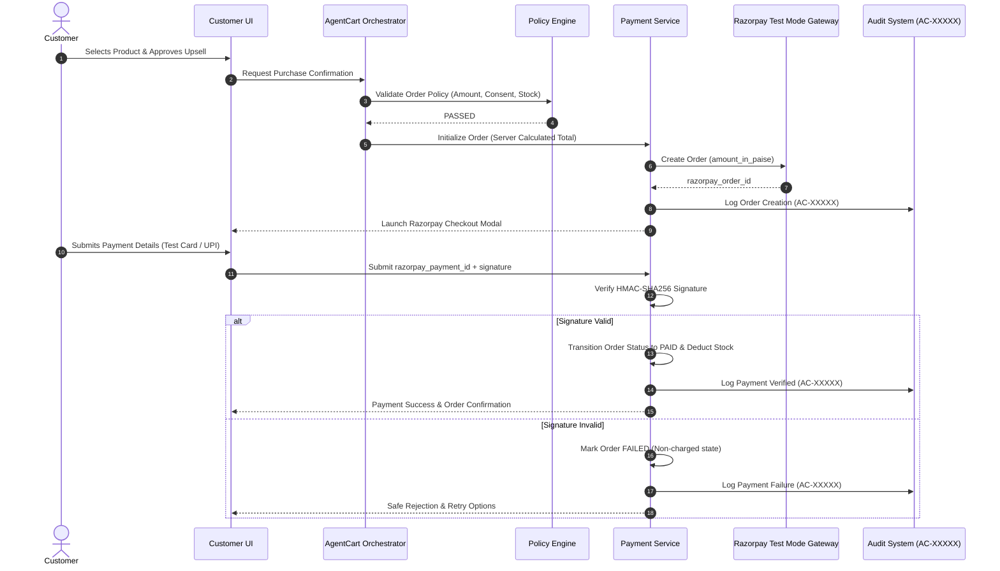

# Razorpay Test Mode Payment Pipeline

## 1. End-to-End Payment Workflow



---

## 2. Server-Side Cryptographic Signature Verification

All payment verification logic is isolated server-side. The frontend signature is validated using `crypto.createHmac`:

```typescript
const generatedSignature = crypto
  .createHmac('sha256', CONFIG.RAZORPAY_KEY_SECRET)
  .update(`${data.razorpayOrderId}|${data.razorpayPaymentId}`)
  .digest('hex');

const isValid = generatedSignature === data.razorpaySignature;
```

---

## 3. Order Lifecycle State Machine

$$\text{PENDING} \xrightarrow{\text{Policy Pass}} \text{PROCESSING} \xrightarrow{\text{Signature Verified}} \text{PAID}$$
$$\text{PROCESSING} \xrightarrow{\text{Signature Failed / Gateway Error}} \text{FAILED}$$
